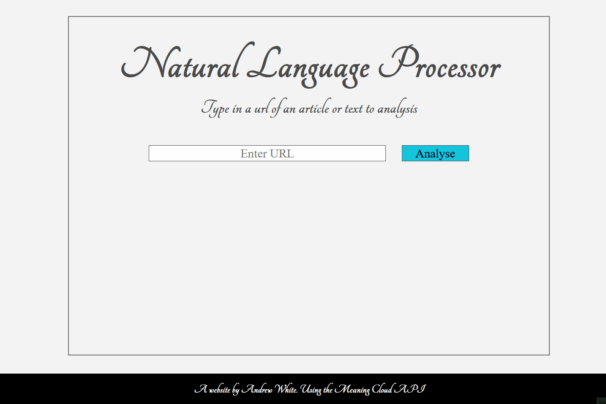

# Natural Language Processor App


_A gif showing the operation of the Natural Language Processor App_

A simple webpage app that will analyse the language of any article or webpage with a URL.

This is a full stack solution that uses a front end client with HTML, CSS and Javascript. Along side a backend solution using Node and Express which is responsible for making calls to a third party API [Meaning Cloud](https://https://www.meaningcloud.com/) that performs the language analyses.

The purpose of this project was to get the developer familiar with Webpack, SASS and Jest. A production and development Webpack configuration were set up and multiple Webpack plugins and loaders were utilized. A basic service worker using the Webpack WorkboxPlugin was also used.

## How to Use

The analyses of the articles or webpages entered by the user is performed using a third party API [Meaning Cloud](https://https://www.meaningcloud.com/). Therefore an API key is needed for the project to function. This key can be acquired by signing up to the meaning cloud services for free.

Once an API key is acquired, download the project files and create a .env file in the root of the project, then enter the following. Replacing the X's with your API key.

```
API_KEY = 'XXXXXXX'
```

Using a command line program go to the root directory of the project:

- Install all the project dependencies using `npm install`
- You then have several options:
  - `npm start:dev` to run the development server
  - `npm run build-dev` to build the project in the development configuration then `npm start` to start the server
  - `npm run build-prod` to build the project in the production configuration then `npm start` to start the server
- Visit http://localhost:8080/ in your browser to see the webpage interface

# Overview

## Front End

The webpage front end provides the user interface to enter the article or webpages URL and view the results. It is a responsive design that works on all screen sizes from mobiles to desktops.

When the user clicks the analyse button, the client will validate the URL entered, if there is an issue an error will be displayed. When a correct URL is entered and Analyse clicked the client makes a POST request using the fetch api to the local server (see next section). While waiting for a response a spinning loader is displayed on the webpage. The response from the local server is then displayed on the page. If the server returns with a failure status an error message is displayed to the user.

Styling for the client is written in SASS and using Webpack tools is converted into minified CSS for production and Javascript for the development environments.

## Backend

The backend is written using Javascript in Node using the Express framework. When the client makes a POST request to '/process-url' endpoint, the backend uses the URL send in the POST request to construct a URL for an API call to the Meaning Cloud services. The response is validated, if there is no data or invalid data a failure status is send back to the client, if the response is successful it is converted to a custom object, stringified and sent back to the client.
